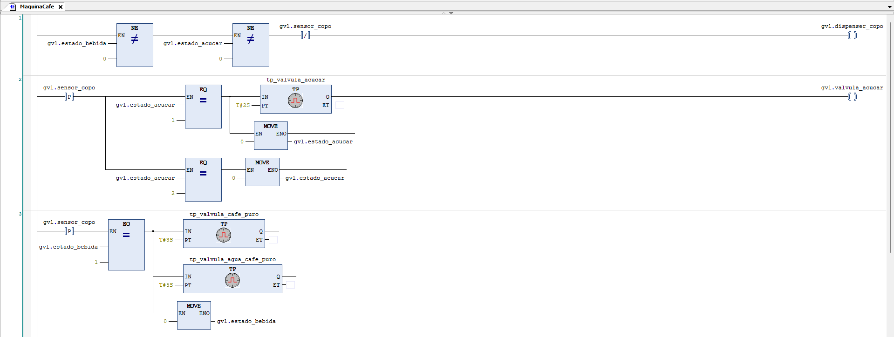
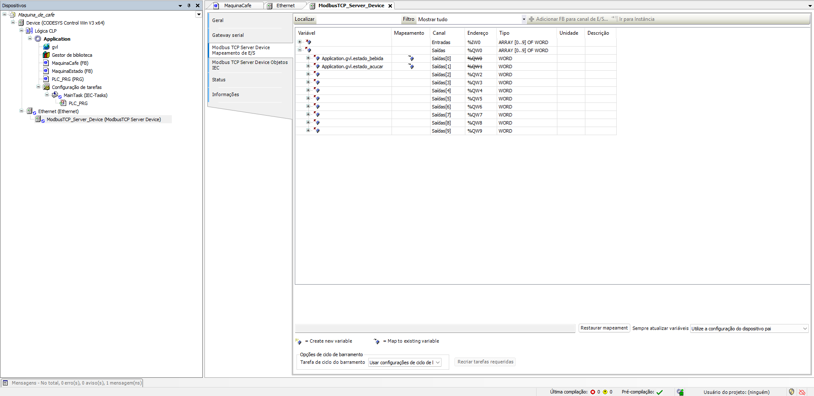
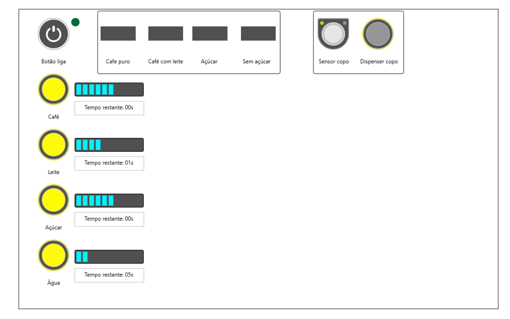

Automação de Máquina de Café - CODESYS & Python

Este projeto demonstra a integração entre um sistema de controle industrial e um sistema de supervisão utilizando o protocolo Modbus TCP.
O objetivo deste projeto foi desenvolver o controle de uma máquina automática de bebidas quentes, seguindo as seguintes especificações técnicas:

Requisitos de Hardware e Insumos
- Reservatórios: Café solúvel, leite em pó, açúcar e água quente.
- Sensores/Atuadores: Sensor de presença de copo, dispositivo alimentador de copos e eletroválvulas de dosagem.

Receitas
A dosagem é controlada pelo tempo de abertura das válvulas:
- Café Puro: 3s de café + 5s de água.
- Café com Leite: 2s de café + 3s de leite + 7s de água.
- Açúcar: Amargo (0s) ou Doce (2s).

Fluxo de Operação
1. O sistema aguarda a detecção de um copo posicionado.
2. O usuário seleciona o tipo de bebida e a opção de açúcar.
3. O processo inicia apenas após o acionamento do botão de partida.
4. O ciclo finaliza quando o copo cheio é retirado.

Funcionalidades
- Lógica Ladder: Implementação de uma máquina de estados para o processo de venda de bebidas com café. O cliente seleciona um tipo de bebida específica e o CLP faz toda
a lógica através da linguagem Ladder para abrir e fechar válvulas, ler sensores e entregar a bebida. Abaixo, um trecho da implementação da lógioca em Ladder, responsável por gerenciar os ciclos de preparo:

- Integração Modbus: O CODESYS atua como servidor Modbus TCP, disponibilizando dados de sensores e status do processo. Para a comunicação com o supervisório em Python, as variáveis de estado foram mapeadas nos registradores conforme a imagem abaixo:

- Supervisório em Python: Script que lê os registradores do CLP e exibe o status em tempo real. Além disso, atualiza uma lista contendo os valores dos insumos disponíveis no estoque e os mostra no display.
- Interface Homem-Máquina: Interface para o monitoramento do código, feita pensando em monitorar o tempo de cada válvula aberta e controlar os sensores digitais do programa. Além disso, a interface conta com leds que sinalizam quando uma válvula está aberta e com displays que mostram o tempo restante até o produto final ficar pronto.

Tecnologias
- CODESYS V3.5 (SoftPLC)
- Python 3 (Biblioteca pyModbusTCP)
- Protocolo Modbus TCP

---
*Projeto desenvolvido para consolidar conhecimentos em redes industriais e programação de CLPs.*
